## The Apollo Guidance Computer
From 1992 to 2010, I had the opportunity to engage in historical research on the Apollo Guidance Computer (AGC) and its interfaces with the Apollo spacecraft. This work led me to learn about computers in the 1960s, the beginnings of integrated logic gate circuits, and to personally meet the designers (Eldon C. Hall, Hugh Blair-Smith, Alan Green, Ramon Alonso from MIT's Instrumentation Lab, Clint Frasier from NASA, and David Bates from Raytheon), programmers (Donal Eyles), astronauts (John Young from Apollo 10 and Apollo 16, Fred Haise from Apollo 13) who used the AGC, computer historians (Frank O'Brien and Ronald Burkey), and modern NASA engineers (Richard Katz). I did a lot of research during my visits to MIT's Drapper Lab in 1999 and to NASA's Office of Logic Design MAPALD conferences in Washington (2004 and 2006). In 2004, I presented the results of my research on the interface between the AGC and the manual control of the Apollo spacecraft as a use case of the same hardware interface with different functions (implemented through mission software) and the use of software virtual machines (Interpreters) during the 1960s. This research has been used as a references to some publications, and also used in the Virtual AGC project (https://www.ibiblio.org/apollo/#gsc.tab=0). Below, I present some links of interest regarding the events, papers, and photographs.
 
 
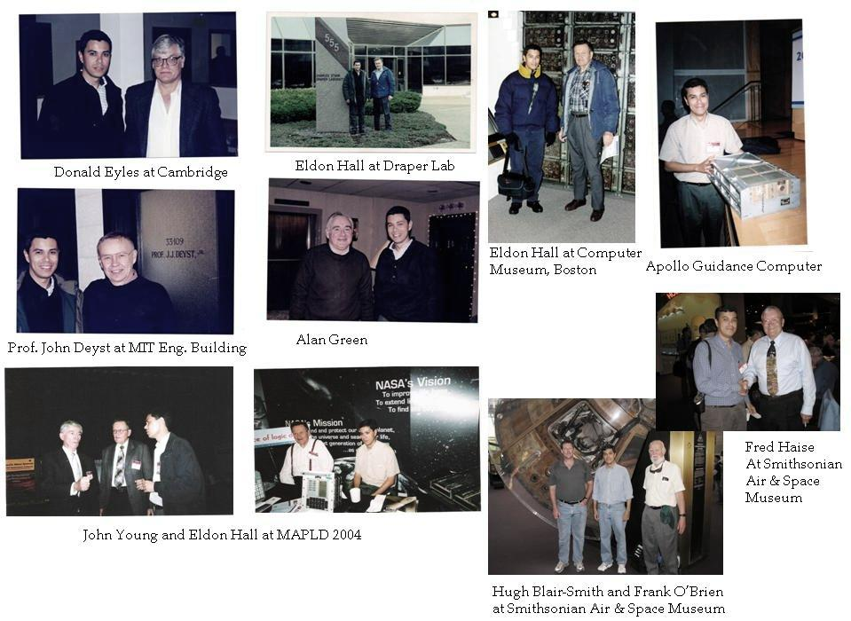
 
 
# 1.- MAPALD 2004 Conference:
https://www.klabs.org/mapld04/program_sessions/session_g.html

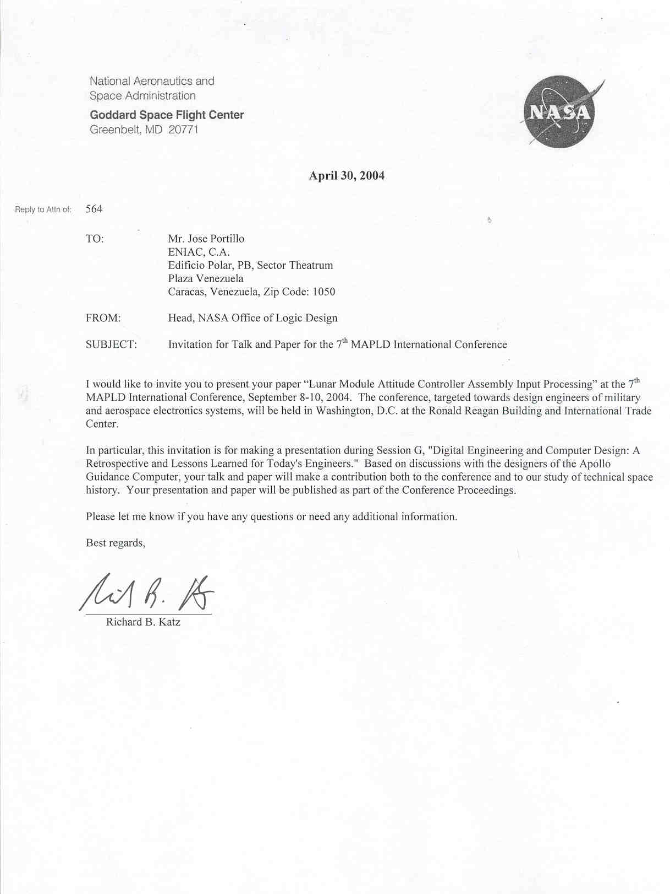

# MAPALD 2004 Blog:
https://jportillolugo.blogspot.com/2007/03/conferencia-nasa-mapld-2004-digital.html

# 2.- APOLLO Lunar Landing Challenge: An Opportunity to review what was learned from the Apollo project? By Eldon C. Hall
https://github.com/jportillo34/ApolloGuidanceComputer/blob/5ebb2f7fd67cd609d910a8669bf156bf94830cba/Corrections%20to%20SPECIAL%20RELATIVITY%20%20Final-March%202016.pdf

# 3.- MAPALD 2006 Conference:
https://jportillolugo.blogspot.com/2007/03/conferencia-nasa-mapld-2006-digital.html

# 4.- Lunar Module Attitude Controller Assembly Input Processing memo:
https://web.mit.edu/digitalapollo/Documents/Chapter8/portillo.pdf
https://www.ibiblio.org/apollo/klabs/papers/g202_portillo_p.pdf
 
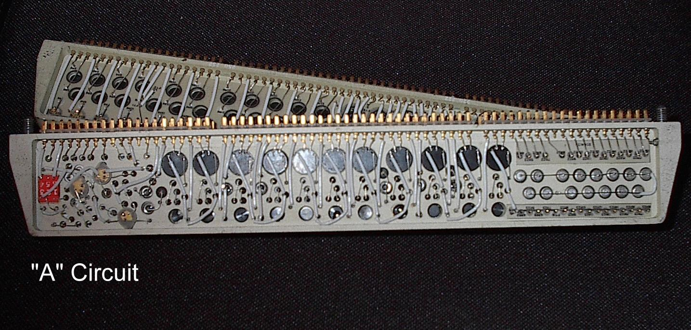
* Apollo Guidance Computer's A Circuit interface module *
 
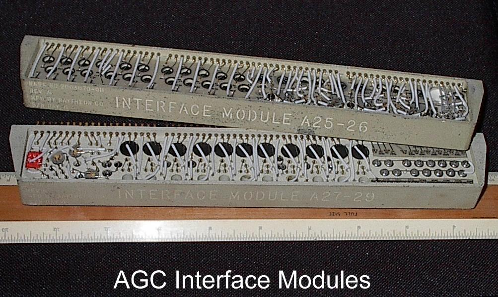
* Apollo Guidance Computer's interface modules *
 
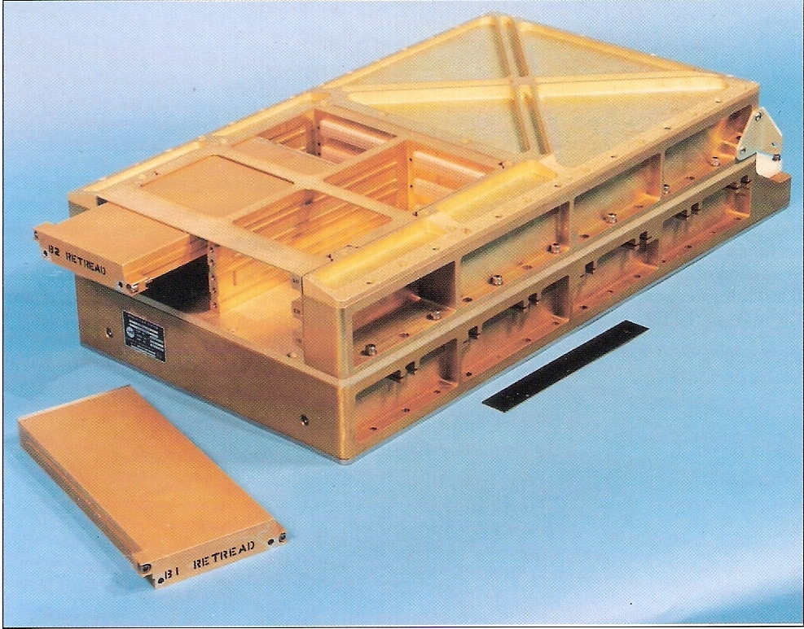
* The Apollo Guidance Computer Block II *
 
 
 
 

* Compare AGC's Dual NOR Gate logic module versus an MOTOROLA's 68701 Microcontroller (1970s era) and an Microchip's RISC microcontroller (1990s era). I had the opportunity to program both processors *
 
 
 
 
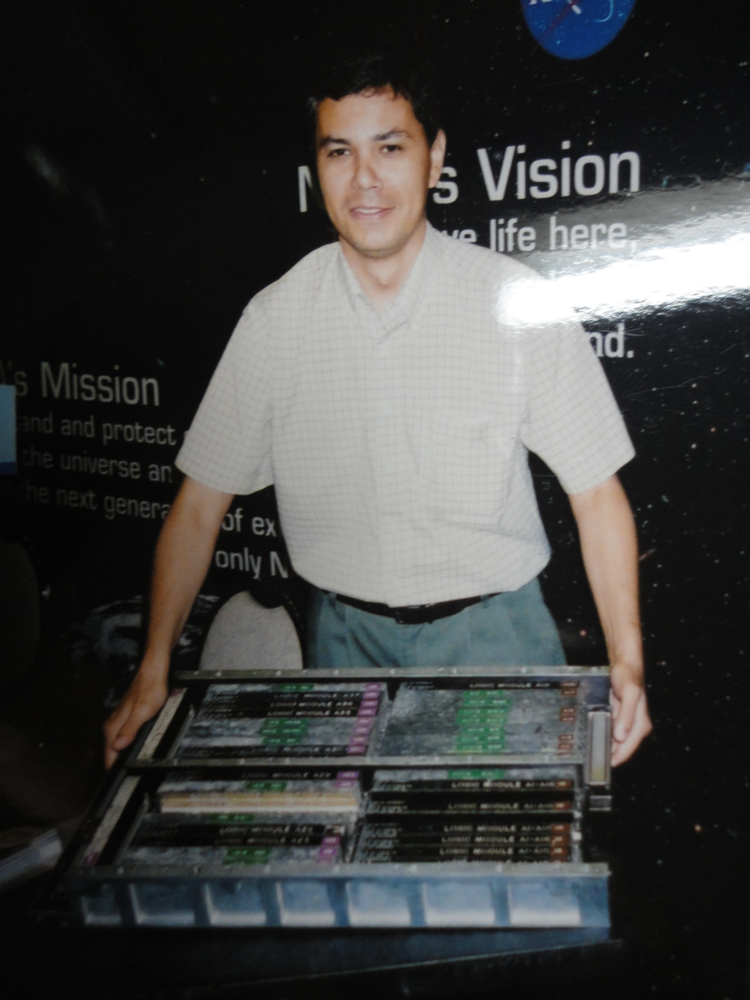
* The AGC Block I tray (MAPALD 2004 conference) *
 
 
 
 
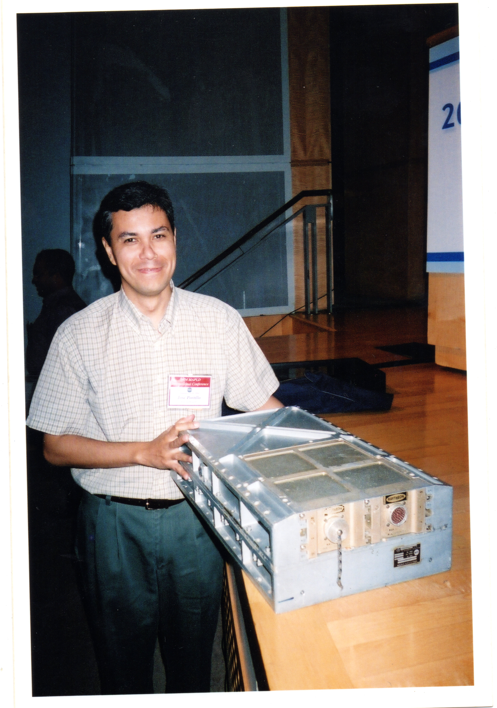
* The AGC Block II (MAPALD 2004 conference) *
 
 
 
 
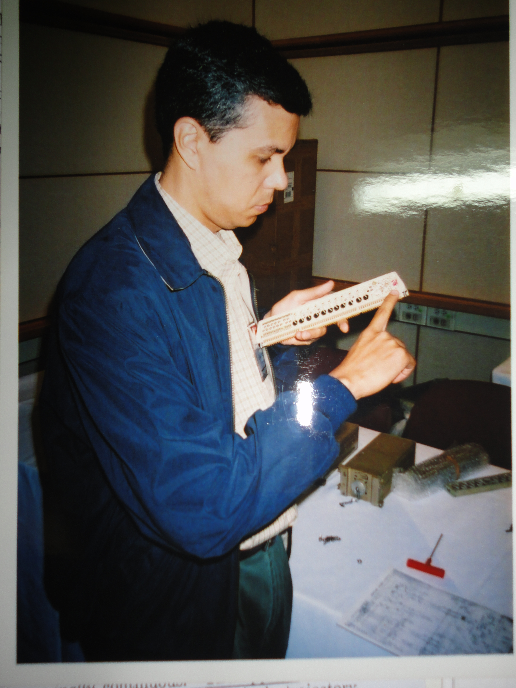
* AGC's interface circuit (MAPALD 2004 conference) *
 
 
 
 
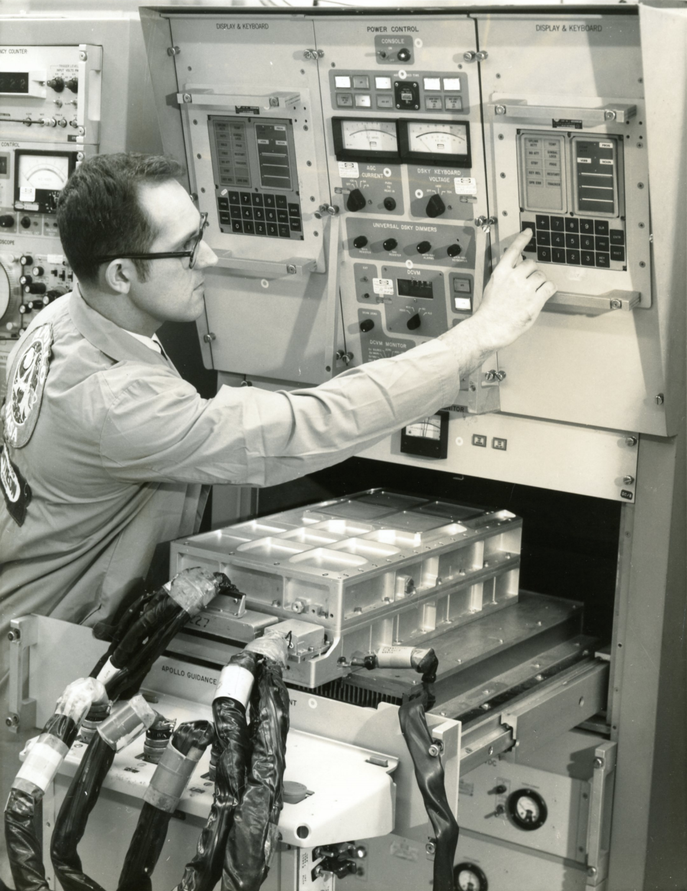
* The Apollo Guidance Computer in its test stand at Raytheon *
 
 
 
 
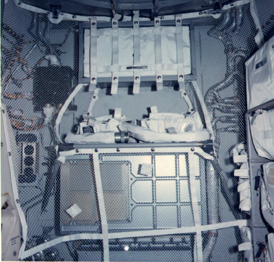
* The Apollo Guidance Computer inplace inside the Apollo 15's Lunar Module *
 
 
 
 
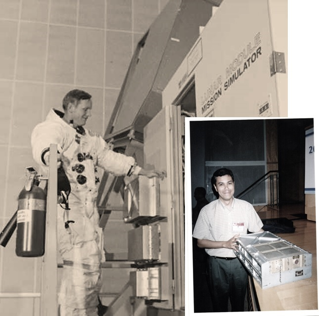
* Astronaut Neil Armstrong with the AGC in the Apollo Lunar Module Mission Simulator in 1969 (NASA) and an AGC in 2004 (MAPALD 2004) *
 
 
# 5.- MAPLD 2004 presentation:
http://klabs.org/mapld04/presentations/session_p/p202_portillo_s.ppt

# 6.- All about Interpreters:
https://jportillolugo.blogspot.com/2010/04/conversaciones-con-hugh-blair-smith.html
